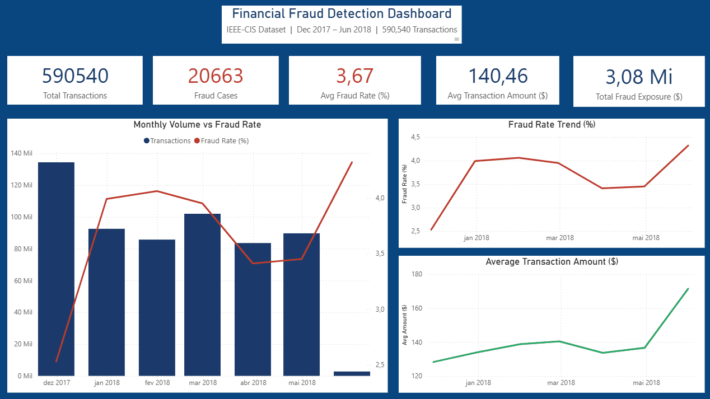

# 🏦 Fraude Detection ETL Pipeline


---

## 🎯 The Problem

Every day, a bank or fintech receives millions of transactions from different sources — core banking, cards, PIX. Before any analysis or fraud detection model can run, this data needs to be **ingested, validated, transformed and stored with quality**.

This pipeline breaks silently in production when not well built. A null value in the wrong column, a timestamp not converted to UTC, a loader that takes 60 minutes instead of 2 — all of these have real financial consequences.

**This project builds it the right way.**

---

## 📊 Dashboard Preview



> 3 analytical pages — Executive Overview, Card Network Analysis, High Value Fraud Transactions

---

## 💡 Key Findings

After processing **590,540 real financial transactions** from the IEEE-CIS Fraud Detection dataset:

| Finding | Data | Business Impact |
|---|---|---|
| **Fraud rate nearly doubled** | Dec/17: 2.53% → Feb/18: 4.06% | Risk team alert — new fraud vector emerging |
| **Discover credit most vulnerable** | 7.93% fraud rate | Weakest controls among card networks |
| **Average fraud amount growing** | $128 → $171 over 6 months | Fraudsters escalating to higher value targets |
| **1,008 high-value fraud cases** | Above 95th percentile | $931 avg — manual review queue candidates |
| **Card testing pattern detected** | $2,161 repeated in Jan/18 | Automated bot testing cards at fixed amounts |

---

## 🏗️ Architecture
```
Raw Data Sources
─────────────────
IEEE-CIS CSV Files (590k rows, 394 cols)
train_transaction.csv  →  Core Banking simulation
train_identity.csv     →  KYC system simulation

        ↓ Extract
─────────────────────────────────
CsvExtractor (OOP/ABC pattern)
  - BaseExtractor defines contract
  - validate() enforced on all sources
  - Fail-fast on missing critical columns

        ↓ Transform
─────────────────────────────────
TransactionTransformer
  - Unix timestamp → UTC datetime
  - Null categoricals → 'unknown'
  - Type enforcement for PostgreSQL
  - Immutable — never mutates input df

        ↓ Load
─────────────────────────────────
PostgresLoader (COPY protocol)
  - 30x faster than INSERT
  - 590k rows in ~2 minutes
  - Connection pooling via SQLAlchemy

        ↓ Store
─────────────────────────────────
PostgreSQL 15 (Docker)
  - Partitioned by month (7 partitions)
  - Partition pruning on date filters
  - Analytical views + stored procedures

        ↓ Analyze
─────────────────────────────────
SQL Analytics          Power BI Dashboard
LAG / LEAD / RANK  →   3 pages, cross-filtering
Window Functions       Executive + Card + High Value
```

---

## ⚙️ Tech Stack

| Layer | Technology | Decision |
|---|---|---|
| Language | Python 3.13 | — |
| Database | PostgreSQL 15 | Partitioning + window functions |
| Container | Docker + docker-compose | Reproducible environment |
| ORM | SQLAlchemy 2.0 | Connection pooling, engine abstraction |
| Bulk Load | PostgreSQL COPY protocol | 30x faster than `to_sql` INSERT |
| Testing | pytest | 13 tests, fixtures, edge cases |
| CI/CD | GitHub Actions | Automated test gate on every push |
| Logging | Loguru | Structured logs, 30-day retention |
| Visualization | Power BI + Plotly | Dashboard + EDA notebook |

---

## 🚀 Quick Start

### Prerequisites
- Python 3.13+
- Docker Desktop
- Power BI Desktop (optional — for dashboard)

### Setup
```bash
# Clone
git clone https://github.com/thiagofsdata-collab/financial-transactions-etl-pipeline.git
cd financial-transactions-etl-pipeline

# Environment
python -m venv .venv
.venv\Scripts\Activate.ps1       # Windows
source .venv/bin/activate         # Linux/Mac

pip install -r requirements.txt

# Credentials
cp .env.example .env
# Edit .env with your values
```

### Database
```bash
# Start PostgreSQL in Docker
docker-compose up -d

# Verify healthy
docker ps
```

### Run Pipeline
```bash
python -m src.pipeline
```

Expected output:
```
INFO | FINANCIAL TRANSACTIONS ETL PIPELINE STARTING
INFO | STEP 1: EXTRACT — 590,540 rows extracted
INFO | STEP 2: TRANSFORM — types enforced, nulls handled
INFO | STEP 3: LOAD — COPY complete in ~2 minutes
INFO | PIPELINE COMPLETED SUCCESSFULLY
INFO | metrics: rows_loaded: 590540, status: success, duration: 369s
```

### Tests
```bash
pytest tests/ -v
# 13 passed in 2.77s
```

---

## 🗄️ SQL Analytics
```sql
-- Monthly fraud evolution
SELECT * FROM vw_fraud_summary;

-- Fraud by card network
SELECT * FROM vw_fraud_by_card;

-- Top 5 fraud cases per month (RANK window function)
SELECT * FROM (
    SELECT *,
        RANK() OVER (
            PARTITION BY DATE_TRUNC('month', "TransactionDT")
            ORDER BY "TransactionAmt" DESC
        ) AS rank_in_month
    FROM transactions_partitioned
    WHERE "isFraud" = 1
) r WHERE rank_in_month <= 5;

-- Sudden amount spikes — fraud signal (LAG window function)
SELECT
    "TransactionID",
    "TransactionAmt",
    LAG("TransactionAmt") OVER (
        PARTITION BY "card4" ORDER BY "TransactionDT"
    ) AS prev_amt,
    ROUND("TransactionAmt" / NULLIF(LAG("TransactionAmt") OVER (
        PARTITION BY "card4" ORDER BY "TransactionDT"
    ), 0), 2) AS spike_ratio
FROM transactions_partitioned
WHERE "isFraud" = 1
ORDER BY spike_ratio DESC NULLS LAST
LIMIT 20;

-- Stored procedures
CALL refresh_fraud_stats('2018-01-01');
CALL flag_high_risk_transactions(1000.00);
```

---

## 📁 Project Structure
```
financial-transactions-etl-pipeline/
  src/
    extractors/
      base_extractor.py     ← ABC pattern — contract for all extractors
      csv_extractor.py      ← CSV implementation
    transformers/
      transaction_transformer.py  ← type enforcement, null handling
    loaders/
      postgres_loader.py    ← COPY protocol bulk insert
    utils/
      logger.py             ← structured logging, 30-day audit trail
      config.py             ← centralized .env reading (Singleton)
    pipeline.py             ← ETL orchestrator with metrics
  sql/
    01_create_tables.sql    ← partitioned table by month
    02_create_views.sql     ← analytical views
    03_procedures.sql       ← stored procedures
    04_analytical_queries.sql ← LAG, LEAD, RANK
  notebooks/
    01_eda_report.ipynb     ← Plotly fraud analysis
  dashboard/
    fraud_detection.pbix         ← Power BI dashboard
    fraud_detection_demo.gif     ← interactive demo
  tests/
    test_transformer.py     ← 13 pytest tests
  .github/workflows/
    ci.yml                  ← GitHub Actions CI
  docker-compose.yml
  requirements.txt
  .env.example
  Makefile
```

---

## 📈 Performance

| Method | Time for 590k rows |
|---|---|
| `to_sql` chunksize=1000 | ~60 minutes |
| `to_sql` chunksize=10000 | ~10 minutes |
| **PostgreSQL COPY protocol** | **~6 minutes ✅** |

---

## 🧪 Test Coverage
```
tests/test_transformer.py — 13 tests

TestValidateRequiredColumns
  ✅ test_passes_with_all_required_columns
  ✅ test_raises_when_column_missing
  ✅ test_raises_when_multiple_columns_missing

TestConvertTimestamp
  ✅ test_converts_to_datetime
  ✅ test_first_transaction_date
  ✅ test_does_not_modify_original_df

TestFillCategoricals
  ✅ test_fills_nulls_with_unknown
  ✅ test_unknown_value_used
  ✅ test_non_null_values_preserved

TestTransform
  ✅ test_transform_returns_dataframe
  ✅ test_transform_preserves_row_count
  ✅ test_isfraud_is_integer
  ✅ test_transform_fails_on_missing_columns
```

---

## 👤 Author

**Thiago Feliciano** — Data Analyst | Analytics Engineer
[GitHub](https://github.com/thiagofsdata-collab) •
[LinkedIn](https://linkedin.com/in/thiago-feliciano-40a1461b9/)

---

## 🔮 Next Steps

- [ ] ML Pipeline — XGBoost fraud scoring model on top of this data
- [ ] Apache Airflow — scheduled daily pipeline runs
- [ ] Cloud deployment — AWS RDS + S3 for production environment
- [ ] Streaming — Apache Kafka for real-time transaction ingestion
